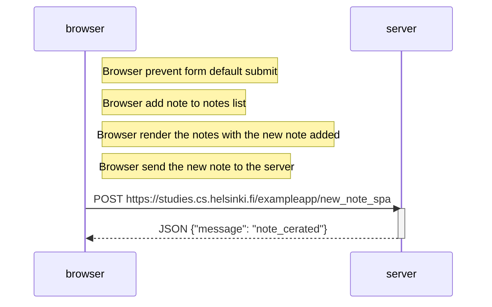

```mermaid

sequenceDiagram
participant browser
participant server

    Note right of browser: Browser prevent form default submit
    Note right of browser: Browser add note to notes list
    Note right of browser: Browser render the notes with the new note added
        Note right of browser: Browser send the new note to the server

    browser->>server: POST https://studies.cs.helsinki.fi/exampleapp/new_note_spa
    activate server
    server-->>browser: JSON {"message": "note_cerated"}
    deactivate server

```